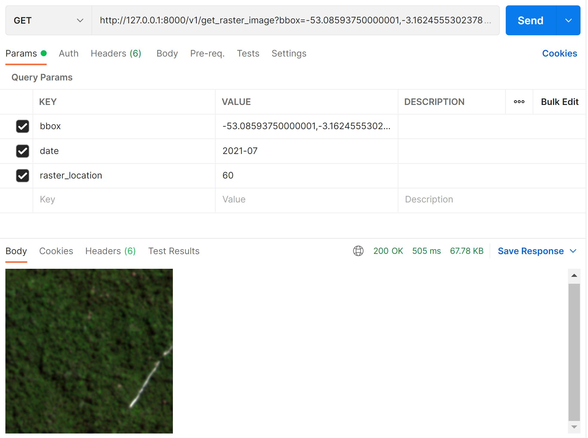

# Running the Service:

Before running anything, make sure to set up the credentials of PLANET_API_KEY on the .env file

After running the **make build and run** commands you should be able to test the api as below

## Fetching Mosaics:

Below will fetch all the images from mosaic *planet_medres_normalized_analytic* for date **2021-08** and bounding box **-53,-4,-52,-3**

```
curl --location --request GET 'http://your_host:8000/v1/fetch_mosaics?mosaic_name=planet_medres_normalized_analytic&date=2021-08&bbox=-53,-4,-52,-3'
```

## Getting a raster image

Below will get the **60** raster of the above mosaic for the date **2021-07** and bounding box **-53.08593750000001,-3.162455530237873,-52.91015625000001,-2.9869273933348883**. Note that raster number still needs to be converted into a coordinate item. 

```
curl --location --request GET 'http://127.0.0.1:8000/v1/get_raster_image?bbox=-53.08593750000001,-3.162455530237873,-52.91015625000001,-2.9869273933348883&date=2021-07&raster_location=60'
```

<p align="center">
    
</p>